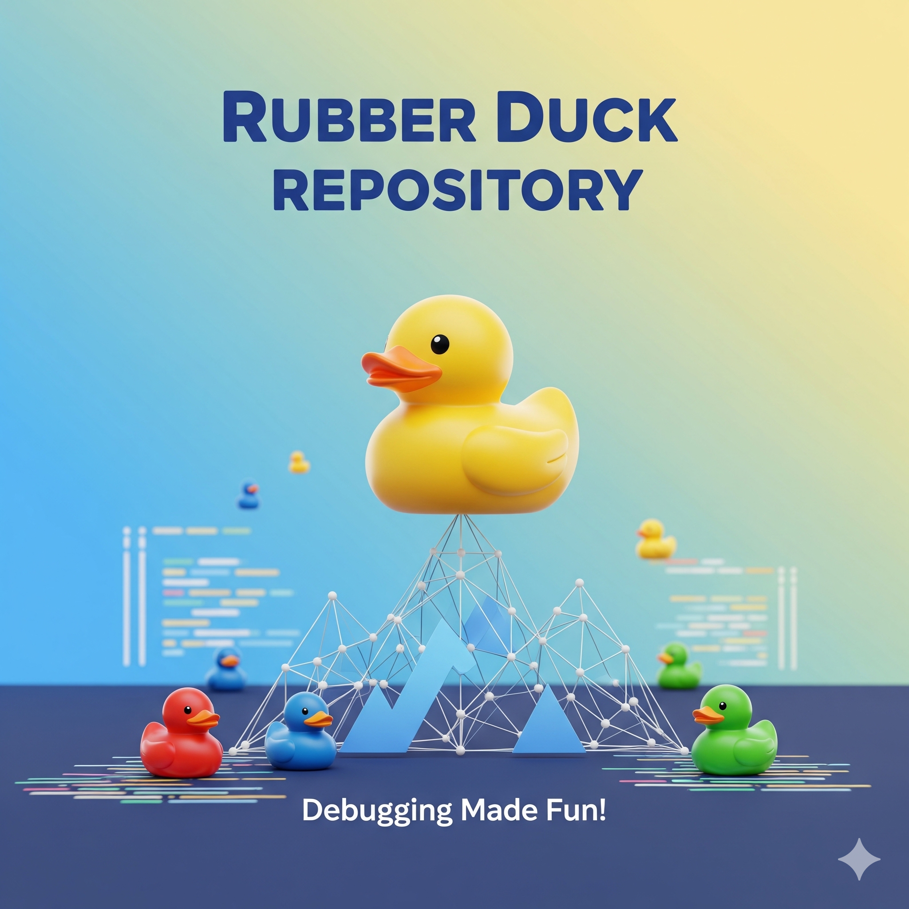

<div align="center">



# 🦆 Rubber Duck

### The Senior Dev That Roasts Your Code

*Rubber duck debugging was never meant to be this personal.*

[](https://rubber-duck.yashwanth-dev.workers.dev)
[](https://hacks.elevenlabs.io/hackathons/1)
[](https://developers.cloudflare.com/workers/)
[](https://elevenlabs.io)

</div>

---

## 🎬 Demo

<!-- Replace the placeholder below with your actual demo video link -->
<!-- To add: drag & drop an MP4 into a GitHub issue/PR, copy the URL, paste here -->

> 🎥 **[Demo video coming soon — drop your MP4 link here]**

https://github.com/user-attachments/assets/REPLACE_WITH_YOUR_VIDEO_ID

---

## 💡 What Is This?

**Rubber Duck** takes "rubber duck debugging" to the extreme. Paste any GitHub repo URL, and a brutally honest AI Senior Developer will:

1. **Scan your codebase** — fetches files via the GitHub API and picks the most roast-worthy ones
2. **Read your actual code** — analyzes imports, logic, error handling, naming, performance, and security
3. **Roast you with surgical precision** — generates savage but technically accurate code reviews powered by Cloudflare Workers AI
4. **Say it out loud** — ElevenLabs text-to-speech narrates every devastating critique with a condescending voice, synced word-by-word with a typewriter reveal

The more you submit, the meaner it gets. A **shame escalation system** tracks your humiliation across the session — from *Novice Shame* all the way to *Architect-Level Shame*.

---

## ✨ Features

| Feature | Description |
|---------|-------------|
| 🔍 **Deep Code Analysis** | AI reads actual code — quotes function names, spots bugs, calls out anti-patterns |
| 🗣️ **Voice Roasting** | ElevenLabs TTS with word-level timestamps for real-time text-voice sync |
| 📈 **Shame Escalation** | Progressive insult levels — roasts get meaner with every file reviewed |
| 🔥 **Full Repo Verdict** | One-click whole-repository roast with cross-file analysis |
| 💾 **Roast Caching** | Previously roasted files are cached — switch between them instantly |
| 🔒 **Private Repos** | Supports GitHub Personal Access Tokens for private repository access |
| ⚙️ **Configurable AI** | Choose from 8+ Workers AI models (Qwen 2.5 Coder, Llama 4, DeepSeek, etc.) |
| 🎤 **Voice Selection** | Pick your roaster's voice from the ElevenLabs voice library |
| 🎨 **Neobrutalist UI** | Bold design with shake, glitch, emoji reactions, and particle effects |

---

## 🏗️ Architecture

```
┌─────────────────────────────────┐
│         Browser (React 19)      │
│                                 │
│  useAgent() ←── WebSocket ──→  Durable Object: RoastAgent
│                                 │        │
│  ElevenLabs TTS ← browser-side │        ├── GitHub REST API
│  Audio + word-level sync        │        ├── Cloudflare Workers AI
│                                 │        └── Session state (shame, cache, history)
└─────────────────────────────────┘
```

### How It Works

1. **User pastes a GitHub URL** → RoastAgent fetches the repo tree via GitHub API
2. **File picker** scores files by size, name patterns, and depth → selects the most roast-worthy
3. **Code pre-loading** fetches actual file contents and stores them in the Durable Object
4. **AI generates roasts** using Cloudflare Workers AI with deeply engineered prompts that include real code context, cross-file analysis, and language-adaptive hints
5. **TTS playback** calls ElevenLabs `/with-timestamps` API directly from the browser for word-synced typewriter reveal
6. **Shame escalates** with every roast — the AI's tone gets progressively more unhinged

---

## 🛠️ Tech Stack

| Layer | Technology |
|-------|------------|
| **Frontend** | React 19, Vite, Tailwind CSS v4 |
| **Backend** | Cloudflare Workers, Durable Objects, Agents SDK |
| **AI Inference** | Cloudflare Workers AI (default: Qwen 2.5 Coder 32B) |
| **Voice Synthesis** | ElevenLabs Streaming TTS (`eleven_flash_v2_5`) |
| **Repo Access** | GitHub REST API (public + private with PAT) |
| **Real-time Comms** | WebSocket via `useAgent` hook |
| **Deployment** | Cloudflare Workers (`wrangler deploy`) |

---

## 🚀 Quick Start

### Prerequisites

- Node.js 18+
- [Cloudflare account](https://dash.cloudflare.com) with Workers AI enabled
- [ElevenLabs API key](https://elevenlabs.io) (free tier works)
- Wrangler CLI (installed as a dev dependency)

### 1. Clone & Install

```bash
git clone https://github.com/katipally/rubber-duck.git
cd rubber-duck
npm install
```

### 2. Configure Secrets

Create `.dev.vars` for local development:

```env
ELEVENLABS_API_KEY=your_elevenlabs_api_key
GITHUB_TOKEN=your_github_personal_access_token
```

Create `.env` for frontend:

```env
VITE_ELEVENLABS_API_KEY=your_elevenlabs_api_key
```

> ⚠️ Never commit secrets. Both files are in `.gitignore`.

### 3. Run Locally

```bash
npm start
```

Opens on `http://localhost:8787`. The Vite dev server runs with Cloudflare Workers local runtime.

### 4. Deploy to Production

```bash
# Set production secrets
npx wrangler secret put ELEVENLABS_API_KEY
npx wrangler secret put GITHUB_TOKEN

# Build and deploy
npm run deploy
```

---

## 📁 Project Structure

```
rubber-duck/
├── src/
│   ├── agents/
│   │   └── roast-agent.ts       # Durable Object — core AI logic, RPC methods, state
│   ├── components/
│   │   ├── FileList.tsx          # Sidebar file list with roast/re-roast/clear buttons
│   │   ├── GitHubInput.tsx       # Repo URL input + PAT support
│   │   ├── RoastDisplay.tsx      # Roast text with typewriter + TTS-synced reveal
│   │   ├── ShameDashboard.tsx    # Shame level, progress bar, roast history
│   │   ├── SettingsPanel.tsx     # Model + voice selection
│   │   └── ParticleBackground.tsx  # Ambient particle visualization
│   ├── hooks/
│   │   └── useStreamingTTS.ts    # ElevenLabs /with-timestamps browser-side TTS
│   ├── lib/
│   │   ├── constants.ts          # All config — models, limits, defaults
│   │   ├── github.ts             # GitHub API — tree fetch, file content, file picker
│   │   └── prompts.ts            # AI prompt engineering — savage, overview, full repo
│   ├── app.tsx                   # Main React app — orchestrates everything
│   ├── server.ts                 # Worker entry point — routes agent requests
│   └── styles.css                # Neobrutalist theme + animations
├── assets/
│   └── cover.png                 # Project cover image
├── wrangler.jsonc                # Cloudflare Workers config
├── vite.config.ts                # Vite build config (worker + client)
└── package.json
```

---

## 🎭 The Roast Engine

The magic is in the prompts. Rubber Duck doesn't just comment on file names — it reads your actual code and delivers technically accurate devastation:

**What it analyzes:**
- Real bugs, logic errors, and missing edge cases
- Performance issues (with Big-O complexity callouts)
- Security vulnerabilities (hardcoded secrets, missing validation, XSS vectors)
- Missing error handling and silent failure patterns
- Cross-file issues (unused imports, duplicated logic, broken contracts)
- Language-specific anti-patterns (TypeScript `any` abuse, Python bare `except:`, Go ignored errors)

**Example roast output:**
> *"Let's start with `useAgent<any, RoastAgentState>` — using `any` here is like leaving a gaping hole in your type safety. Then we see `handleRoastFile` with `.catch(() => {})` — silently swallowing errors like they're just suggestions. And the `DUCK_EMOJIS` array... is this a code review tool or a kindergarten sticker book? Have you considered that your error handling strategy of 'pretend nothing happened' might not scale past your localhost?"*

---

## ⚙️ Configuration

### AI Models

Switch models in the Settings panel. Available options:

| Model | Specialty |
|-------|-----------|
| **Qwen 2.5 Coder 32B** *(default)* | Code-specialized, best for reviews |
| Llama 4 Scout 17B | Fast, good general reasoning |
| Llama 3.3 70B | High quality, slower |
| Llama 3.1 8B | Lightweight, fast |
| DeepSeek R1 Distill | Deep reasoning |
| Gemma 3 12B | Balanced speed/quality |
| Mistral Small 24B | Efficient, multilingual |
| Kimi K2.5 | Strong coding ability |

### Voice Selection

Pick a voice from ElevenLabs in the Settings panel. The app curates a list of voices suited for condescending code reviews — from a posh British butler to an exasperated Silicon Valley tech bro.

---

## 🏆 Built for ElevenHacks

This project was built for [**ElevenHacks Week 1**](https://hacks.elevenlabs.io/hackathons/1) — the Cloudflare partner track.

**Required integrations:**
- ✅ **ElevenLabs** — Streaming text-to-speech with word-level timestamps for real-time voice sync
- ✅ **Cloudflare Workers** — Serverless compute, request routing, and static asset serving
- ✅ **Cloudflare Workers AI** — LLM inference for AI-powered code review and roast generation
- ✅ **Cloudflare Durable Objects** — Persistent session state (shame level, roast cache, history)
- ✅ **Cloudflare Agents SDK** — WebSocket real-time communication via `AIChatAgent` with `@callable()` RPC

---

## 🔒 Security & Data Handling

- Personal Access Tokens are used only for GitHub API calls and are never stored permanently
- All API keys are managed via Wrangler secrets (production) and `.dev.vars` (local) — never in source control
- ElevenLabs TTS calls are made directly from the browser to avoid proxy IP blocking on the free tier

---

## 📝 License

MIT

---

<div align="center">

**Built with 🦆 and mass amounts of mass amounts of coffee ☕**

[@CloudflareDev](https://twitter.com/CloudflareDev) · [@elevenlabsio](https://twitter.com/elevenlabsio) · [#ElevenHacks](https://twitter.com/search?q=%23ElevenHacks)

</div>
